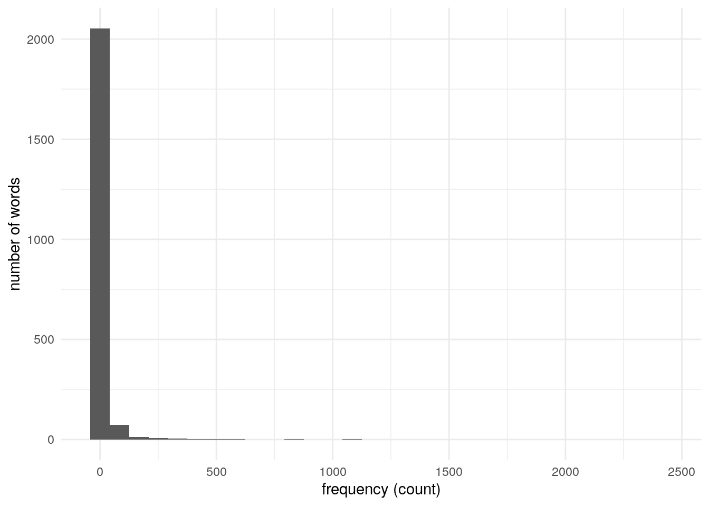

# Chapter 4: POS Tagging


## 30. Reading the result
>Implement a program that reads the result of part-of-speech tagging. Here, represent a sentence as a list of mapping objects, each of which associates a surface form, lemma (base form), part-of-speech tag with the keys text, lemma, pos. Use this representation in the rest of the problems.


```r
lines <- readLines(here("data/alice.txt.conll"))

alice <- tibble(id_sentence = numeric(),
                text = character(),
                lemma = character(),
                pos = character())
id_sentence <- 1
for(line in lines){
  if(line == ""){
    id_sentence <- id_sentence + 1
  } else{
    x <- str_split(line, "\t")[[1]]
    alice <- alice %>%
      add_row(id_sentence = id_sentence, text = x[2], lemma = x[3], pos = x[4])
  }
}

alice <- alice %>%
  rowid_to_column("id")

alice %>%
  head()
```

```
## # A tibble: 6 × 5
##      id id_sentence text       lemma      pos  
##   <int>       <dbl> <chr>      <chr>      <chr>
## 1     1           1 ALICE      ALICE      NNP  
## 2     2           1 'S         's         POS  
## 3     3           1 ADVENTURES ADVENTURES NNP  
## 4     4           1 IN         in         IN   
## 5     5           1 WONDERLAND WONDERLAND NNP  
## 6     6           2 Lewis      Lewis      NNP
```

## 31. Verbs
>Extract surface forms of all verbs appearing in the text.


```r
alice %>%
  filter(str_detect(pos, "VB")) %>%
  pull(text) %>%
  head()
```

```
## [1] "was"       "beginning" "get"       "sitting"   "having"    "do"
```

## 32. Base forms of verbs
>Extract lemmas of all verbs appearing in the text.


```r
alice %>%
  filter(str_detect(pos, "VB")) %>%
  pull(lemma) %>%
  head()
```

```
## [1] "be"    "begin" "get"   "sit"   "have"  "do"
```

## 33. A of B
>Extract noun phrases in the form of “A of B”, where A and B are nouns.


```r
is_a_of_b <- function(i){
  alice$pos[i] == "NN" & alice$text[i+1] == "of" & alice$pos[i+2] %in% "NN"
}

a_of_b <- c()
for(i in 1:(nrow(alice)-2)){
  if(is_a_of_b(i)){
    a_of_b <- c(a_of_b, sprintf("%s of %s", alice$text[i], alice$text[i+2]))
  }
}

a_of_b
```

```
##  [1] "plenty of time"          "saucer of milk"         
##  [3] "sort of way"             "flavour of cherry-tart" 
##  [5] "number of bathing"       "knowledge of history"   
##  [7] "subject of conversation" "question of course"     
##  [9] "person of authority"     "sort of circle"         
## [11] "deal of thought"         "sort of thing"          
## [13] "sort of chance"          "sort of life"           
## [15] "kind of thing"           "bit of stick"           
## [17] "yelp of delight"         "game of play"           
## [19] "state of mind"           "tone of delight"        
## [21] "length of neck"          "wink of sleep"          
## [23] "kind of serpent"         "sort of use"            
## [25] "subject of conversation" "cauldron of soup"       
## [27] "agony of terror"         "sort of lullaby"        
## [29] "way of nursing"          "sort of knot"           
## [31] "bit of mushroom"         "PLENTY of room"         
## [33] "cup of tea"              "sort of meaning"        
## [35] "piece of rudeness"       "business of MINE"       
## [37] "sentence of execution"   "scream of laughter"     
## [39] "voice of thunder"        "way of escape"          
## [41] "friend of mine"          "sort of way"            
## [43] "time of life"            "kind of rule"           
## [45] "sentence of execution"   "ledge of rock"          
## [47] "kind of authority"       "scroll of parchment"    
## [49] "court of justice"        "globe of goldfish"      
## [51] "sort of idea"            "piece of evidence"      
## [53] "atom of meaning"         "atom of meaning"        
## [55] "world of trouble"        "half of fright"         
## [57] "half of anger"
```

## 34. A B
>Extract the longest noun phrase consisting of consecutive nouns.


```r
v <- alice %>%
  filter(pos == "NN") %>%
  pull(id)

temp <- cumsum(c(1, diff(v) - 1))
temp2 <- rle(temp)
ids <- v[which(temp == with(temp2, values[which.max(lengths)]))]

alice[alice$id %in% ids, ]$text
```

```
## [1] "CHAPTER" "I."
```

## 35. Frequency of words
>Obtain the list of words and frequencies of their occurrences sorted by descending order of frequency.


```r
freq_words <- alice %>%
  count(lemma) %>%
  arrange(desc(n))

freq_words %>%
  head()
```

```
## # A tibble: 6 × 2
##   lemma     n
##   <chr> <int>
## 1 ,      2418
## 2 the    1639
## 3 '      1130
## 4 `      1081
## 5 be     1076
## 6 .       986
```


## 36. Top-ten frequent words
>Visualize the top-ten frequent words and their frequencies with a chart (e.g., bar chart).


```r
freq_words %>%
  head(10) %>%
  ggplot(aes(x = reorder(lemma, -n), y = n)) +
  geom_bar(stat = "identity") +
  labs(x = "", y = "count") +
  theme_minimal()
```


## 37. Top-ten words co-occurring with ‘Alice’
>Extract the list of words that co-occur with the word “Alice”. Visualize with a chart (e.g., bar chart) the top-ten words co-occurring with the word “Alice” and their frequencies.


```r
id_alice <- alice %>%
  filter(lemma == "Alice") %>%
  pull(id_sentence) %>%
  unique()

alice %>%
  filter(id_sentence %in% id_alice, lemma != "Alice") %>%
  count(lemma) %>%
  arrange(desc(n)) %>%
  head(10) %>%
  ggplot(aes(x = reorder(lemma, -n), y = n)) +
  geom_bar(stat = "identity") +
  labs(x = "", y = "count") +
  theme_minimal()
```


## 38. Histogram
>Draw a histogram of word frequency (x-axis is a scalar range representing a frequency ranging from 1 to the largest frequency of a given word in the entire corpus, and the y-axis is the count of unique words that fall into the count of the x value).


```r
alice %>%
  count(lemma) %>%
  ggplot(aes(n)) +
  geom_histogram() +
  labs(x = "frequency (count)", y = "number of words") +
  theme_minimal()
```

```
## `stat_bin()` using `bins = 30`. Pick better value with `binwidth`.
```




## 39. Zipf’s law
>Plot a log-log graph with the x-axis being rank order and the y-axis being frequency.


```r
alice %>%
  count(lemma) %>%
  mutate(rank = dense_rank(desc(n))) %>%
  ggplot(aes(x = log(rank), y = log(n))) +
  geom_point() +
  theme_minimal()
```


